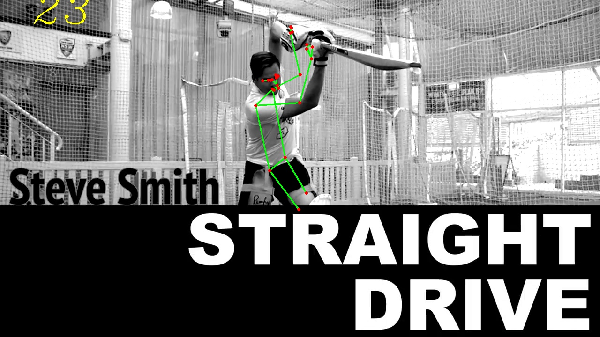
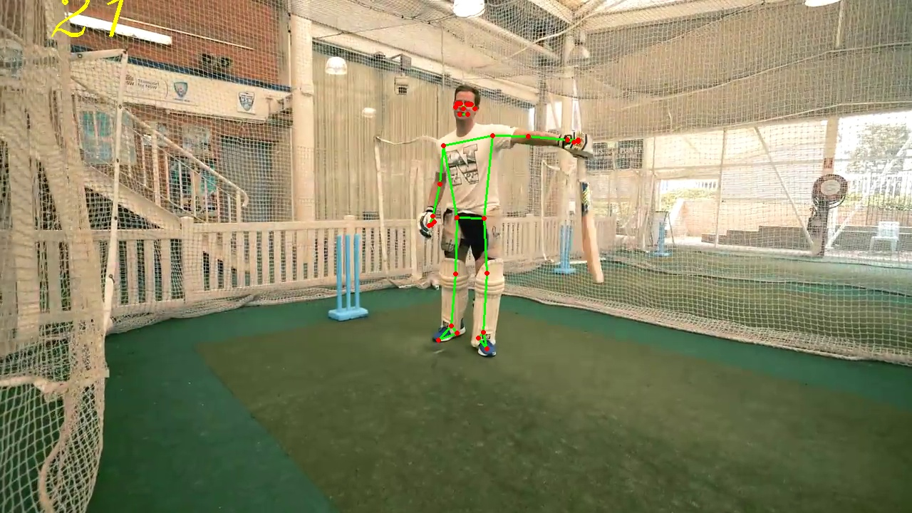
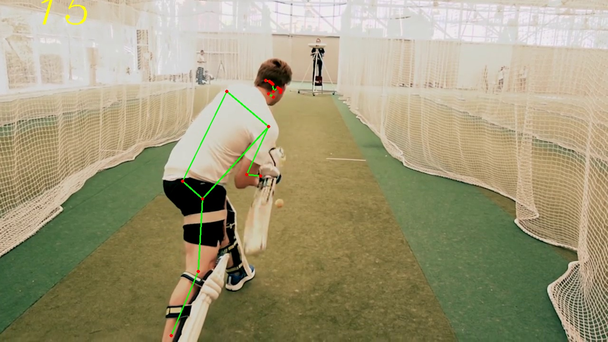
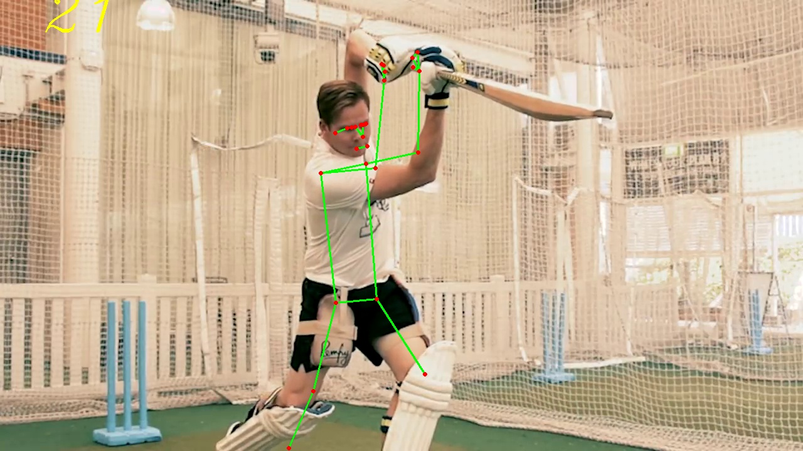

# Pose Estimation Module
A Python module which will work as a boilerplate for any OpenCV projects which involve Pose Estimation. This module makes use of the OpenCV library to read the videos and do some image processing, and the Mediapipe library which has a large number of pre-trained pose landmarks and  features which help with the main objective of this module. 

## How to Use

To use this module for your own projects, just fork/clone this repo and get started.

To test this on your videos, run the terminal from the cloned repo folder and type the following command:

    python3 main.py -v "your_video_here"

## Examples

Here, I will show you some of the examples from a video I testes the file on from a variety of angles and poses.

 

